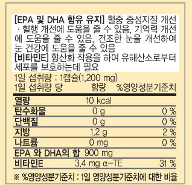

# swift-ocr-cli

**swift-ocr-cli** is a Swift command-line tool that leverages Apple's [Vision](https://developer.apple.com/documentation/vision) framework (macOS only) to perform Optical Character Recognition (OCR) on images. This tool supports multiple input methods and output formats, making it flexible for various use cases.



```bash
$ swift-ocr-cli-arm-mac ./docs/images/test.png ko,en --json
{
  "text" : "[EPA 및 DHA 함유 유지] 혈중 중성지질 개선\n• 혈행 개선에 도움을 줄 수 있음, 기억력 개선\n에 동장에 도수 있 수 건조한 눈을 개선하여\n[비타민트 항산화 작용을 하여 유해산소로부터\n세포를 보호하는데 필요\n1일 섭취량 : 1캡슐(1,200 mg)\n1일 섭취량 당\n함량\n%영양성분기준치\n열량\n10 kcal\n탄수화물\n0 g\n단백질\n지방\n0 g\n1.2 g\n나트륨\n0 mg\nEPA 와 DHA의 합 900 mg\n비타민E\n3.4 mg a-TE\n0 %\n0 %\n2%\n0 %\n31 %\n※ %영양성분기준치 : 1일 영양성분기준치에 대한 비율"
}
```

```
$ swift-ocr-cli-arm-mac ./docs/images/test.png ko,en --json --coordinate
```

- [Output](./docs//output.json)

---

## Installation with Homebrew

You can easily install swift-ocr-cli using [Homebrew](https://brew.sh):

### Install swift-ocr

```bash
brew tap azamara/tap
brew install swift-ocr
```

---

## Features

- **Multiple Input Forms:**  
  Accepts either an image file path or a base64-encoded image string.

- **Output Formats:**  
  - **Plain Text:** Simply outputs the recognized text.  
  - **JSON Format:** Use the `--json` flag to receive coordinates in JSON.

- **Coordinates Mode:**  
  Use the `--coordinate` flag to get recognized text along with bounding box coordinates.  
  The output includes:
  - Recognized text.
  - Bounding box dimensions (`width` and `height`).
  - A default confidence score.
  - Pixel coordinates (`x`, `y`) for the top-left corner of the bounding box.

---

## Requirements

- **macOS:** Version 10.15 or later
- **Xcode:** Version 13 or later (to build Swift tools using Vision)
- **Swift:** Version 5.5 or later

---

## Build & Run

### Cloning the Repository

Clone the repository and change to the project directory:

```bash
git clone <REPO_URL> swift-ocr-cli
cd swift-ocr-cli
```

### Building the Tool

Build the project using Swift Package Manager:

```bash
swift build
```

### Running the Tool

Run the tool with the following syntax:

```bash
swift run swift-ocr-cli <imageFilePath or base64Str> [recognitionLanguages] [--coordinate] [--json]
```

#### Example Usages

1. **Basic Text Recognition (defaults to English):**

    ```bash
    swift run swift-ocr-cli /path/to/image.jpg
    ```

2. **Specifying Custom Recognition Languages:**

    ```bash
    swift run swift-ocr-cli /path/to/image.jpg ko-KR,en-US
    ```

3. **Coordinate Mode with JSON Output:**

    ```bash
    swift run swift-ocr-cli /path/to/image.jpg --coordinate --json
    ```

4. **Using Base64 Input:**

    ```bash
    swift run swift-ocr-cli <base64EncodedImageString> --coordinate
    ```

---

## Release Instructions

To build release versions for different architectures, use the provided scripts.

### Running the Release Script

```bash
./scripts/release.sh
```

### Manual Build Commands

- **For arm64:**

    ```bash
    swift build -c release --arch arm64 --build-path .build/arm64
    ```

- **For x86_64:**

    ```bash
    swift build -c release --arch x86_64 --build-path .build/x86_64
    ```

---

## Testing

A sample test is included which uses a base64-encoded image. Run the tests with:

```bash
swift test
```

---

## License

[Apache License Version 2.0](./LICENSE)
